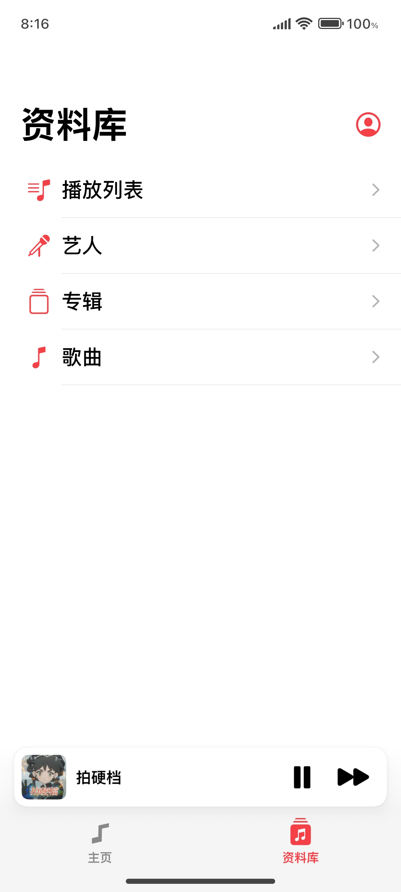
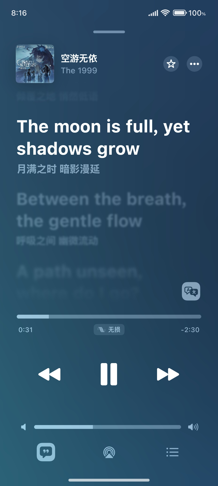

# Flamingo

Flamingo 是一款仿 Apple Music 风格的安卓端本地音乐播放器，目前正在开发中。

⚠ 请注意！本仓库尚未用于上传本软件源码，仅为简单介绍及收集反馈所用。

[📕 English Version](README_en.md)

[常见问题](docs/FAQ.md) | [建议 / 反馈](https://github.com/Yos-X/FlamingoHere/issues) | [赞助开发](https://afdian.tv/a/yos-x)

## 界面

<table width="100%">
  <tr>
    <td align="center"></td>
    <td align="center"></td>
    <td align="center"></td>
  </tr>
  <tr>
    <td align="center"></td>
    <td align="center"></td>
    <td align="center"></td>
  </tr>
</table>

## 基本

### 技术信息

- 使用 Jetpack Compose 开发
- 最低支持 Android 5.0 系统

### 包体信息

- 体积小巧，不足 9 MB
- 完全本地，无需联网，仅申请必要权限

### 功能信息

- 较高的 UI 还原度，较为优美的动画
- 支持基本的播放功能（播放列表功能暂不完善）
- 支持内嵌 / 外挂 TTML 和 LRC 歌词
- 支持小部件
- 优秀的歌词动画和特效
- 拥有许多 Bug

## 特色

### 多歌词格式解析 / 显示支持

Flamingo 支持 `完全的 TTML` 及 `各种 LRC 格式` 歌词的解析与显示，且自带歌词规整功能，可将歌词版式自动规整。

支持的详细歌词格式（这里仅展示部分）：

完整版请查看 [Flamingo 歌词格式支持](docs/LyricFormatSupport.md)。

### 多扩展支持

Lyric Getter API

> 即支持 Lyric Getter，这是一个 Xposed 模块（现支持 LSPosed / LSPatch），通过 Hook 获取音乐软件的歌词，提供给其他模块 / 软件使用。可用于实现状态栏歌词。

Super Lyric API

> 即支持 Super Lyric。一款全新的歌词获取器模块，使用了全新的 API！可用于实现状态栏歌词。

Ticker Lyric

> 支持通过通知中的 Ticker 发送歌词，部分系统 / 模块可使用该功能获取歌词并提供状态栏歌词等服务。

FFmpeg 支持

> 支持使用 FFmpeg aar 扩展（遵循 LGPL 协议）进行音频解码，该解码器默认作为后备启用。

### 大屏幕横屏 UI 支持

支持大屏幕下的横屏 UI，其界面类似 iPad 上的 Apple Music。

**⚠ 小屏幕端的横屏 UI 暂未适配，会强制使用大屏幕 UI，属正常现象。**

## 关于

软件主要开发者为 [Yos-X](https://github.com/Yos-X)。

## 版权

Copyright 2025 MULTIPLY.

All rights reserved.
