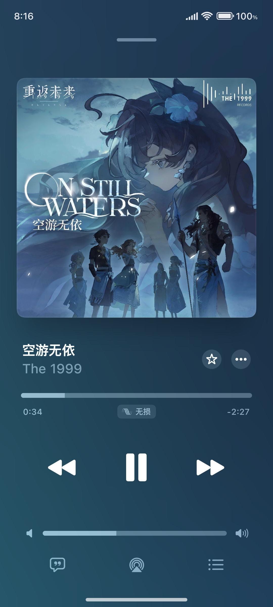

# Flamingo

Flamingo is a local music player for Android, styled after Apple Music, and is currently in development.

⚠ Please note! This repository has not yet been used to upload the app's source code. It is solely for brief introduction and feedback collection.

[📕 Chinese Version](README.md)

[FAQ](./docs/FAQ.md) | [Suggestions / Feedback](https://github.com/Yos-X/FlamingoHere/issues) | [Support Development](https://afdian.tv/a/yos-x)

## Interface

<table width="100%">
  <tr>
    <td align="center"></td>
    <td align="center"></td>
    <td align="center"></td>
  </tr>
  <tr>
    <td align="center"></td>
    <td align="center"></td>
    <td align="center"></td>
  </tr>
</table>

## Basics

### Technical Information
- Developed with Jetpack Compose
- Minimum support for Android 5.0

### Package Information
- Compact size, less than 9 MB
- Fully local, no internet required; only necessary permissions are requested

### Feature Information
- High UI fidelity with elegant animations
- Supports basic playback functions (playlist functionality is currently incomplete)
- Supports embedded / external TTML and LRC lyrics
- Supports widgets
- Excellent lyric animations and effects
- Contains many bugs

## Key Features

### Support for Multiple Lyric Formats (Parsing / Display)
Flamingo supports parsing and display of `full TTML` and `various LRC formats` lyrics, with a built-in lyric formatting function to automatically standardize lyric layouts.

For the full list, see [Flamingo Lyric Format Support](docs/LyricFormatSupport_en.md).

### Multiple Extension Support

Lyric Getter API
> Supports Lyric Getter, an Xposed module (now compatible with LSPosed / LSPatch) that retrieves lyrics from music apps via hooking and provides them to other modules / apps. Can be used to implement status bar lyrics.

Super Lyric API
> Supports Super Lyric, a new lyric retriever module with an updated API! Can be used to implement status bar lyrics.

Ticker Lyric
> Supports sending lyrics via the ticker in notifications; some systems / modules can use this feature to retrieve lyrics and provide services like status bar lyrics.

FFmpeg Support
> Supports audio decoding using the FFmpeg aar extension (compliant with the LGPL license), which is enabled by default as a fallback.

### Large Screen Landscape UI Support
Supports landscape UI on large screens, with an interface similar to Apple Music on iPad.

**⚠ Landscape UI on small screens is not yet adapted and will force the large screen UI; this is normal.**

## About
The main developer of the app is [Yos-X](https://github.com/Yos-X).

## Copyright
Copyright 2025 MULTIPLY.  
All rights reserved.